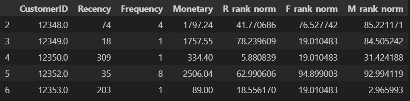
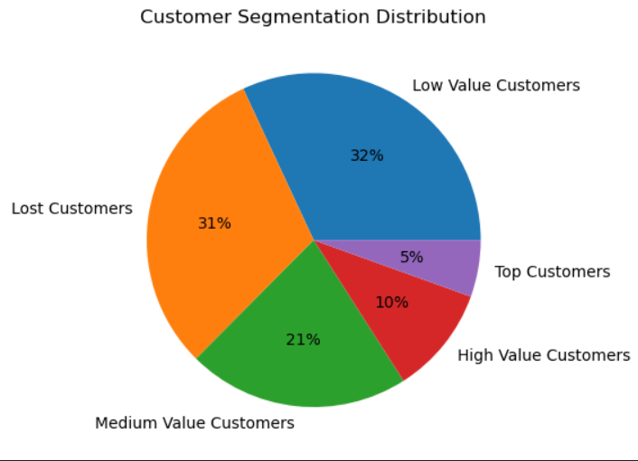
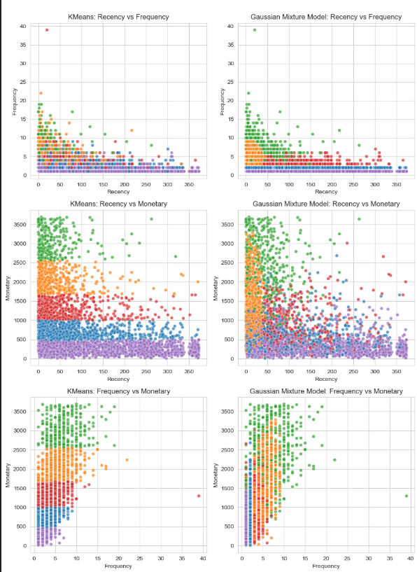
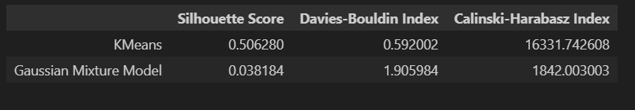

# Market Segmentation
The Online Retail dataset is a transactional dataset that contains detailed records of purchases made by customers from a UK-based online retail store between December 2010 and December 2011. It includes approximately 500,000 rows of data with features such as Invoice Number, Stock Code, Description, Quantity, Invoice Date, Unit Price, Customer ID, and Country. This dataset is commonly used for exploratory data analysis, market segmentation, and customer behavior modeling. Due to its real-world structure and mix of numeric, categorical, and temporal data, it is especially popular in projects involving RFM analysis, clustering, and sales forecasting.

## Preprocessing
In the preprocessing phase, the dataset was cleaned and transformed to compute RFM (Recency,
Frequency, Monetary) features for customer segmentation. Missing values in key fields like
CustomerID and Description were removed, and canceled transactions were filtered out using
invoice numbers that start with 'C'. Additionally, transactions with non-positive Quantity or
UnitPrice were excluded to ensure meaningful purchase data.

RFM features were then derived as follows: Recency was calculated as the number of days since
a customer's most recent purchase relative to the latest date in the dataset, Frequency as the count
of unique transactions (InvoiceNo), and Monetary as the total amount spent by each customer,
computed as Quantity × UnitPrice. To improve clustering quality, the Interquartile Range (IQR)
method was applied to detect and remove outliers from each RFM feature.

After computing the RFM features, customer segmentation was performed to group customers
with similar purchasing behaviors. By applying clustering to the RFM values, the model
identified distinctive customer segments, such as recent and frequent buyers with high spending
(loyal or VIP customers), or customers with low recency and spending (inactive or low-value
customers). This grouping provides valuable data to data to understand different customer
profiles.

These initial segments help us to know the marketing trends. For example, loyal customers can
be rewarded with exclusive offers, while inactive ones can be targeted with reactivation
campaigns. Segmenting customers based on RFM ensures that marketing resources are directed
strategically, improving both customer retention and return on investment.

## Classical Clustering
In the classical clustering step, the K-Means algorithm was applied to the cleaned RFM dataset
to segment customers based on their purchasing behavior. Before clustering, the optimal number
of clusters was determined using the Elbow Method and Silhouette Score, which helped evaluate
the trade-off between cluster compactness and separation. Once the best number of clusters was
identified, K-Means was used to assign each customer to a cluster based on similarity in their
RFM values. In this case, the algorithm found elbow at 5.
These clusters were then interpreted in a business context to uncover meaningful customer
segments. For instance, one cluster may represent high-value, frequent buyers who made recent
purchases that are counted as ideal candidates for loyalty programs while another may consist of
inactive or low-spending customers suitable for re-engagement campaigns. This segment enables
more personalized and effective marketing strategies.

## Generative Modeling
In the second part of clustering, we used Gaussian Mixture Models (GMM) to perform
probabilistic clustering on the RFM features. Unlike K-Means, which assigns each customer to a
single cluster, GMM calculates the probability of each customer belonging to multiple clusters.
This soft clustering approach allows for more nuanced segmentation, especially when customer
behavior overlaps.
To evaluate the best number of clusters, we applied Bayesian Information Criterion (BIC)
method to identify the model with the best fit by balancing clustering accuracy and model
complexity. The resulting GMM clusters were then analyzed similarly to K-Means, providing
additional flexibility in interpreting customer groups.

In this analysis, an autoencoder was not used because the dataset already consisted of three welldefined features which serve as meaningful and interpretable dimensions for clustering. Since
RFM naturally reduces customer behavior into just three dimensions, there was no need for
further dimensionality reduction using an autoencoder or other techniques.
The simplicity and low dimensionality of the RFM features make them ideal for direct
application of clustering algorithms like K-Means and GMM. Introducing an autoencoder in this
case would add unnecessary complexity without significant benefit, especially when the goal is
to maintain interpretability in segmenting customer behavior.

## Segment Interpretation and Comparisons
The visual comparison between K-Means and GMM clustering on RFM data were much
different. K-Means creates more distinct, well-separated clusters with clearly defined boundaries
across all RFM pair plots. In contrast, GMM's segments appear more overlapping and diffuse,
reflecting its probabilistic nature. While both models used the same number of clusters (5), KMeans results in clearer groupings, which are easier to interpret in a business context. For instance, identifying high-frequency or high-monetary customers versus low-value or inactive ones.

Quantitatively, the evaluation metrics strongly favor K-Means. It achieved a significantly higher
Silhouette Score (0.506), lower Davies-Bouldin Index (0.59), and much higher CHI (16,331),
indicating more solid and well-separated clusters. GMM, on the other hand, performed poorly
across all three metrics. Therefore, K-Means not only provides more consistent and interpretable
segmentation but also offers more actionable insights for targeted marketing strategies, such as
loyalty rewards for top spenders or preservation efforts for recently inactive customers.
